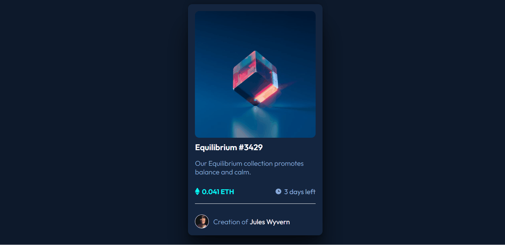
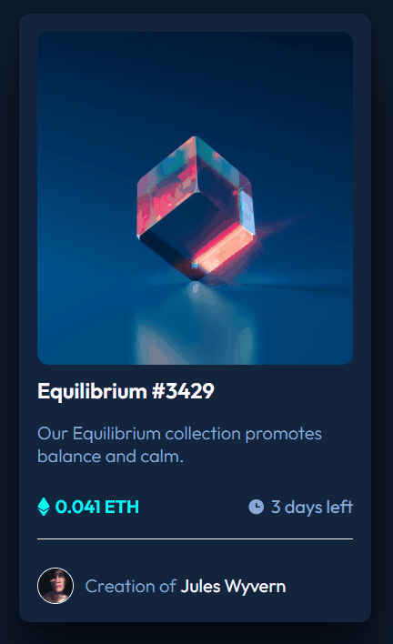

# Componente de cartão de pré-visualização NFT
- Projeto de um card de NFT
- Desafio do Frontend Mentor

# Descrição
- Projeto de um card online de NFT

# Imagens do projeto:

- Desktop

- Mobile

# Indice
- Projeto com uma unica seção de visualização que é o card em si propriamente dito

# Instalação
- Clone o repositório em sua máquina e refatore o código como quiser
-Se você ainda não tem o Git instalado, você pode baixá-lo e instalá-lo a partir do site oficial: git-scm.com.
- No Windows, você pode usar o Prompt de Comando, PowerShell ou o terminal do Git Bash. No macOS e Linux, use o Terminal.
- Navegue até o diretório onde você deseja clonar o repositório e execute o seguinte comando: git clone https://github.com/usuario/repositorio.git
- Substitua https://github.com/usuario/repositorio.git pela URL do repositório que você copiou. O comando git clone cria uma cópia do repositório no seu computador.
- Após a clonagem, navegue até o diretório do repositório clonado: cd repositorio

# Uso
- Refatore e ou melhore este código como e quando quiser
- Utilize este exemplo de card para criar o seu próprio card ou card de sua empresa, expondo suas redes sociais

# Tecnologias utilizadas
- HTML5
- CSS3
- Git Bash (Versionamento de código)
- GitHub (Plataforma de hospedagem)

# Informações adicionais
- Cores: hsl(215, 51%, 70%);/ hsl(178, 100%, 50%);/ hsl(217, 54%, 11%)/hsl(216, 50%, 16%);/hsl(215, 32%, 27%);
- Fontes: ('https://fonts.googleapis.com/css2?family=Outfit:wght@100..900&display=swap') - font-family: "Outfit", serif;
- Bbiblioteca de icones: https://fontawesome.com/icons
- Pontos de quebra sugeridos para responsivo: 980px e 428px

# Autor
- Desenvolvido por Erasmo Carlos

# Agredecimento
- Agredeço aos meus familiares por todo apoio nesse momento de estudo e transição
- E agradeço principalmento aos meus professores do Curso DevQuest por tornar a realização do sonho de programar cada vez mais real

